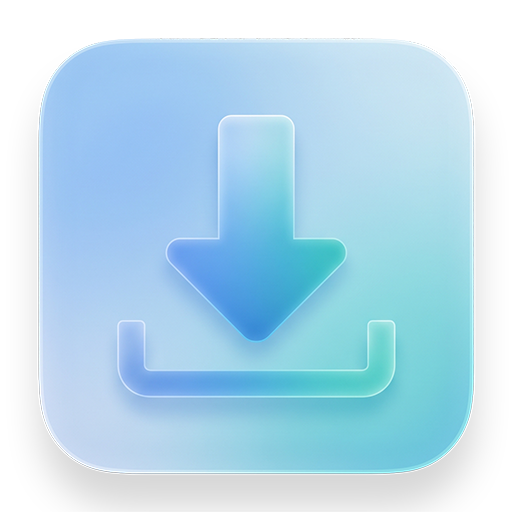
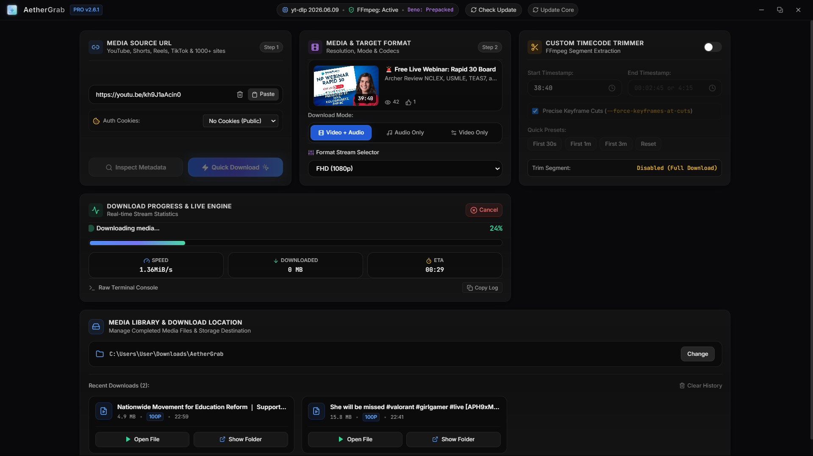

<p align="center">
  <a href="public/icon.png" target="_blank">
    
  </a>
</p>
<div align="center">

### AetherGrab: High-Performance Windows Desktop Media Downloader

[](https://www.electronjs.org/)
[](https://react.dev/)
[](https://vitejs.dev/)
[](https://tailwindcss.com/)
[](https://github.com/yt-dlp/yt-dlp)
[](https://ffmpeg.org)

<p>A modern, high-performance Windows desktop media downloader built with Electron, React, and Tailwind CSS. Powered by yt-dlp and FFmpeg, it delivers fast video and audio extraction across 1,000+ web platforms with a glassmorphic Bento Grid interface.</p>

<p align="center">
  <a href="demo.png" target="_blank">
    
  </a>
</p>

---
</div>

> [!IMPORTANT]
> Download only media you own or are authorized to use. You are responsible for complying with YouTube's terms and applicable copyright law.

---

## Features

- **1000+ Platform Support**: Download video and audio content from YouTube, Shorts, Instagram Reels, TikTok, Snapchat, and more.
- **Glassmorphic Bento UI**: 3D interactive tilt cards powered by Framer Motion and Tailwind CSS.
- **Real-time Stream Engine**: Live progress bar, bandwidth meter (MB/s), ETA timer, and raw terminal console inspector.
- **Format & Stream Inspector**: Quality presets (4K 2160p, 2K 1440p, 1080p, 720p, MP3 Audio) and stream format ID lookup.
- **Custom Timecode Trimmer**: FFmpeg keyframe-accurate segment clipping (`--download-sections`).
- **Auth Cookie Support**: Session cookie integration (Chrome, Edge, Firefox, Brave, Opera, or custom `cookies.txt`).
- **Media Library & History**: Local download folder picker and historical download queue with open/show-in-folder controls.
- **Auto-Updating Application**: Integrated in-app updater and embedded `yt-dlp` binary updater.

---

## Tech Stack

- **Framework**: [Electron](https://www.electronjs.org/) (v33) + [React](https://react.dev/) (v18)
- **Bundler**: [Vite](https://vitejs.dev/)
- **Styling**: [Tailwind CSS](https://tailwindcss.com/) + [Framer Motion](https://www.framer.com/motion/)
- **Icons**: [Lucide React](https://lucide.dev/)
- **Backend Core**: [yt-dlp](https://github.com/yt-dlp/yt-dlp) & [FFmpeg](https://ffmpeg.org/)

---

## Getting Started

### Prerequisites

- [Node.js](https://nodejs.org/) (v18 or higher)
- `npm` or `yarn`

### Installation

1. Clone the repository:
   ```bash
   git clone https://github.com/Yavagu/AetherGrab.git
   cd AetherGrab
   ```

2. Install dependencies:
   ```bash
   npm install
   ```

3. Run in development mode:
   ```bash
   npm run electron:dev
   ```

4. Build production binaries:
   ```bash
   npm run electron:build
   ```

---

## License

This project is licensed under the [MIT License](LICENSE).
